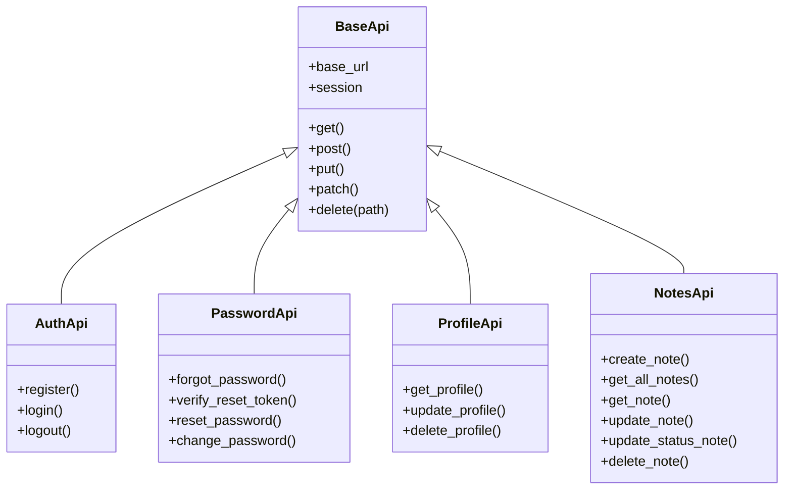
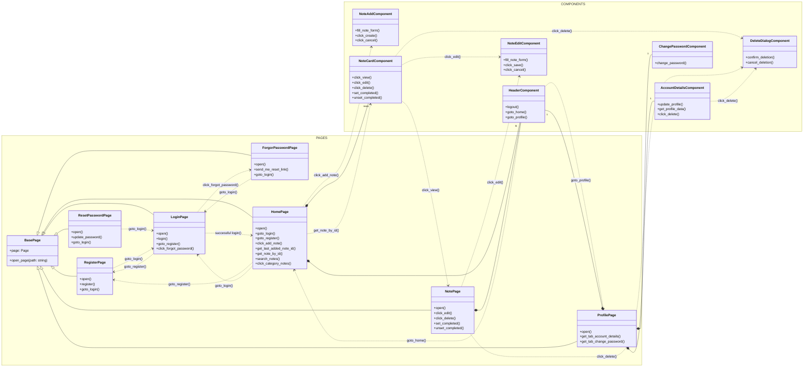
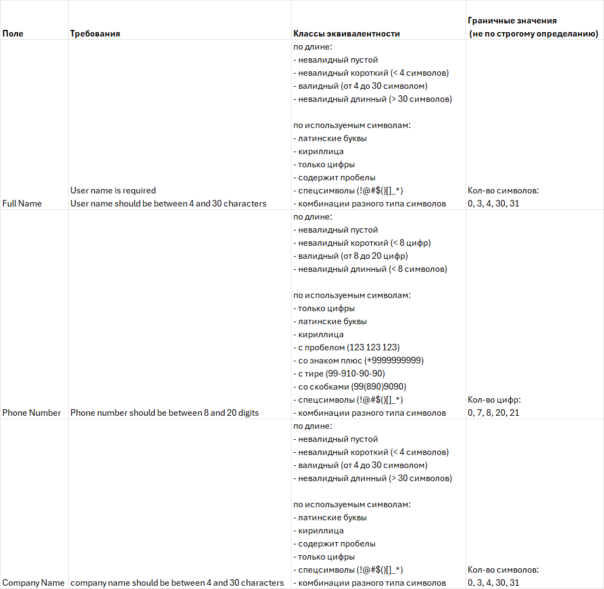
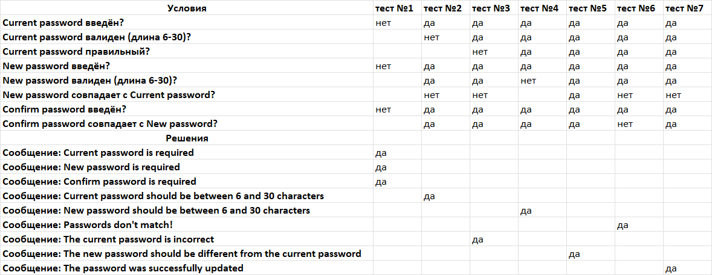
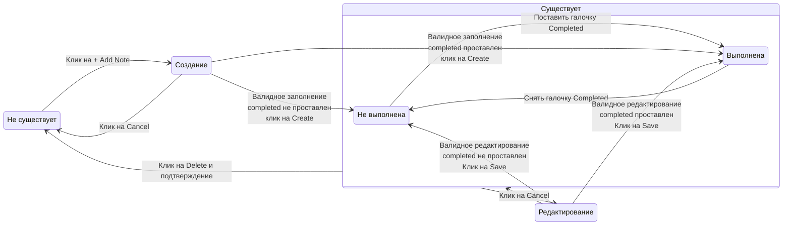
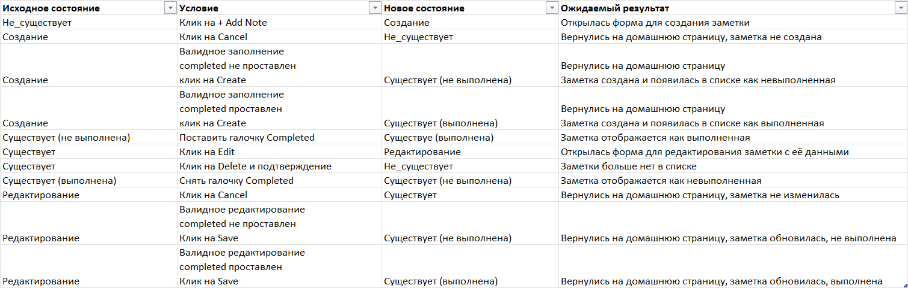

# Демо-проект по тестированию API и UI Приложения с заметками
## Тестирование API
[Swagger Docs](https://practice.expandtesting.com/notes/api/api-docs/#/)  
Схема тестирования API

Каждый метод тестировался только с валидными данными
## Тестирование UI
[Приложение](https://practice.expandtesting.com/notes/app)  

Схема тестирования UI

**Демонстрация применения основных техник тест-дизайна**
### Классы эквивалентности и граничные значения
Пример: форма редактирования профиля


Запуск тестов: `pytest .\ui\tests\test_profile.py::test_update_profile -v`

### Попарное тестирование 
Пример: Заполнение формы добавления заметки

| Поле        | Значения                               | Количество вариантов |
|-------------|----------------------------------------|----------------------|
| Category    | Home, Work, Personal                   | 3                    |
| Completed   | отмечен / не отмечен                   | 2                    |
| Title       | Валидный / Пустой / Короткий / Длинный | 4                    |
| Description | Валидный / Пустой / Короткий / Длинный | 4                    |

Всего комбинаций: 3\*2\*4\*4 = 96

Для попарного тестирования: 16 комбинаций 

```
valid valid Personal False
short short Work False
long long Home False
empty empty Home True
empty long Work True
long short Personal True
short valid Home True
valid empty Work True
empty short Home False
valid long Home True
short empty Personal False
long valid Work True
empty valid Personal True
long empty Home True
short long Personal True
valid short Home True
```
Запуск тестов: `pytest .\ui\tests\test_notes.py::test_add_note -v`

### Таблица принятия решений
Пример: Заполнение формы смена пароля  

рассмотрены не все возможные варианты, а основные пользовательские сценарии: форма не заполнена, потом отдельно обрабатываем каждую ошибку


Запуск тестов: ` pytest .\ui\tests\test_profile.py::test_change_password -v`

### Диаграмма состояний и переходов
Пример: Жизненный цикл заметки


Таблица состояний и переходов

Запуск тестов: `pytest .\ui\tests\test_life_cycle_note.py -v`

